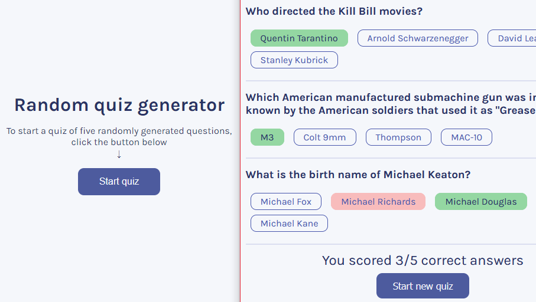

<h1>Open Trivia DB frontend</h1>

Published on GitHub Pages: [sentenzo.github.io/front-opentdb/](https://sentenzo.github.io/front-opentdb/)

This one was made to consolidate my knowledge on React.

It's a small frontend-only project, which utilizes [Trivia API](https://opentdb.com/api_config.php) (an open API for quizes).

- [Description](#description)
  - [Toolset:](#toolset)

## Description
This is a one-page web-application to generate and pass quizes. It is takes random quiz questions from Trivia DB (via the API they provide).

The idea of the project was taken from [Scrimba React cours](https://scrimba.com/learn/learnreact). They've also provided a nice design template: [link (Figma)](https://www.figma.com/file/Re5nbvHAjPXG7wfby7CJbq/Quizzical-App).

### Toolset:
- Node.js + TypeScript + Sass
- React + [`create-react-app`](https://create-react-app.dev/)
- [Trivia API](https://opentdb.com/api_config.php)
- GitHub Actions (to publish on GitHub Pages)